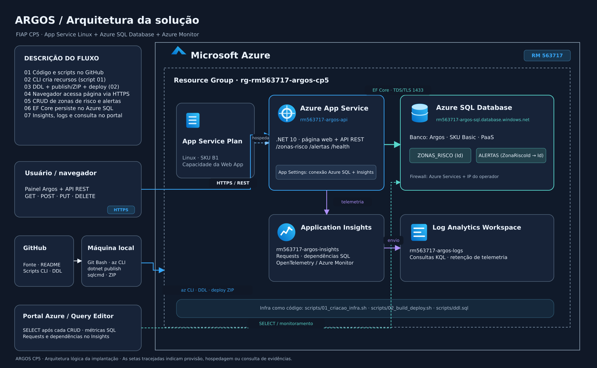

# Argos — zonas de risco e alertas na Azure

O Argos é uma aplicação web para registrar **zonas de risco** e **alertas** vinculados a elas. A interface permite consultar e gerenciar os registros; a API REST oferece operações GET, POST, PUT e DELETE para as duas entidades. Os dados são persistidos em **Azure SQL Database**, e o **Application Insights** recebe a telemetria da aplicação.

Este repositório contém o código fonte, o esquema SQL, os scripts Azure CLI para provisionamento e deploy e a documentação necessária para executar a solução em outra assinatura. O deploy é feito com `az webapp deploy` a partir da publicação .NET gerada localmente.

## Arquitetura



[Desenho editável em draw.io](docs/arquitetura-argos.drawio) · [Descrição da arquitetura](docs/arquitetura.md)

O navegador acessa a interface e a API no **Azure App Service Linux**. A API usa **Entity Framework Core** para ler e gravar no **Azure SQL Database**. As tabelas `dbo.ZONAS_RISCO` e `dbo.ALERTAS` têm relacionamento 1:N por `ALERTAS.ZonaRiscoId`. Requisições e dependências são encaminhadas ao **Application Insights**, vinculado a um **Log Analytics Workspace**. O banco é um serviço PaaS, sem contêiner ou máquina virtual de SQL.

A imagem apresenta os nomes usados no ambiente de referência. Os scripts derivam os nomes da configuração local; outros RMs produzem nomes diferentes.

## Tecnologias

| Tecnologia | Finalidade |
| --- | --- |
| .NET 10 e ASP.NET Core Minimal API | Interface web e endpoints REST |
| HTML, CSS e JavaScript | Página servida pela própria API |
| Entity Framework Core e provedor SQL Server | Acesso e persistência relacional |
| Azure App Service Linux | Hospedagem da aplicação |
| Azure SQL Database | Banco de dados PaaS |
| Azure Monitor OpenTelemetry e Application Insights | Telemetria da aplicação |
| Log Analytics Workspace | Armazenamento e consulta dos logs de monitoramento |
| Azure CLI, Bash e `az webapp deploy` | Criação de recursos e publicação |
| `sqlcmd` | Execução automatizada do DDL |

O código de `ZonaRisco` e `NivelRisco` foi adaptado de [ArgosApi-NET](https://github.com/Driven-Soft/ArgosApi-NET). A estrutura dos scripts foi baseada em [Fidelis-DevOps](https://github.com/Driven-Soft/Fidelis-DevOps), projeto separado desta aplicação.

## Organização do repositório

```text
Argos-CP5/
├── README.md
├── .env.example
├── docs/
│   ├── arquitetura-argos.drawio
│   ├── arquitetura-argos.png
│   ├── arquitetura.md
│   └── json-operacoes.md
├── scripts/
│   ├── 00_config_geral.sh
│   ├── 01_criacao_infra.sh
│   ├── 02_build_deploy.sh
│   ├── 03_remocao_infra.sh
│   └── ddl.sql
└── src/Argos.Api/          # API, entidades, acesso ao banco e wwwroot/
```

O arquivo [scripts/ddl.sql](scripts/ddl.sql) define as duas tabelas, a chave estrangeira e o índice do relacionamento. O contrato e exemplos JSON de cada operação estão em [docs/json-operacoes.md](docs/json-operacoes.md).

## Pré-requisitos

- Assinatura Azure com permissão para criar Resource Group, App Service, Azure SQL Database, Log Analytics Workspace e Application Insights, além de cota na região escolhida.
- **Azure CLI** autenticada na assinatura correta.
- **.NET SDK 10** para compilar e publicar a API.
- **Bash**, **curl** e **sqlcmd** para executar os scripts e aplicar o DDL automaticamente.
- Para compactar a publicação: **`zip` no Linux/WSL** ou **PowerShell e `cygpath` no Git Bash do Windows**. No Git Bash com PowerShell disponível, `zip` não precisa ser instalado.
- Conectividade com Azure, NuGet e Azure SQL na porta TCP 1433. O script 02 consulta `api.ipify.org` para identificar o IP público da máquina; a variável `SQL_CLIENT_IP` permite informá-lo manualmente.

Os valores padrão usam App Service Plan **B1**, Azure SQL Database **Basic** e região **Brazil South**. Esses recursos podem gerar custos enquanto estiverem ativos.

### Instalação no Windows

Execute no PowerShell os comandos referentes aos componentes ausentes:

```powershell
winget install --exact --id Git.Git
winget install --exact --id Microsoft.AzureCLI
winget install Microsoft.DotNet.SDK.10
winget install sqlcmd
```

Abra novamente o Git Bash após a instalação e verifique:

```bash
az version
dotnet --version
sqlcmd --version
command -v curl
command -v powershell.exe
command -v cygpath
```

### Instalação no Linux/WSL

Instale Azure CLI, .NET SDK 10 e `sqlcmd` conforme a distribuição. No Ubuntu/WSL, `sudo apt-get install curl zip` instala os outros utilitários necessários. Confirme `dotnet --version`, `az version`, `sqlcmd --version`, `curl --version` e `zip -v`.

## Como implantar

Os comandos a seguir partem da **raiz deste projeto**, onde estão `README.md`, `scripts/` e `src/`.

### 1. Configurar o ambiente

```bash
cp .env.example .env
```

Edite `.env` com seu RM e o login que será criado como administrador do novo servidor Azure SQL:

```dotenv
RM=rm123456
LOCATION=brazilsouth
SQL_ADMIN_USER=admin_argos
# SQL_ADMIN_PASSWORD='defina_uma_senha_forte'
# SQL_CLIENT_IP=203.0.113.10
```

`RM` deve conter `rm` e seis dígitos. A senha SQL pode ficar no `.env` ou ser digitada, sem aparecer na tela, quando os scripts 01 e 02 a solicitarem. Se optar pelo prompt, informe **a mesma senha** em ambos. O login e a senha são definidos na criação do servidor; não é necessário obter credenciais de um banco preexistente.

Por padrão, o script cria `rg-<RM>-argos-cp5`, `<RM>-argos-api`, `<RM>-argos-sql`, `<RM>-argos-logs`, `<RM>-argos-insights` e o banco `Argos`. `WEBAPP_NAME` e `SQL_SERVER_NAME` precisam ser exclusivos globalmente; podem ser personalizados no `.env`, assim como os tamanhos e a região. Veja as opções em [.env.example](.env.example). O arquivo `.env` é ignorado pelo Git e **não deve ser publicado**.

### 2. Criar os recursos Azure

```bash
az login
az account list -o table
az account set --subscription '<ID-DA-ASSINATURA>'
az account show -o table
bash scripts/01_criacao_infra.sh
```

O script 01 registra os provedores necessários e cria o Resource Group, o plano e a Web App Linux, o servidor e o banco Azure SQL, a regra de acesso para serviços Azure, o Log Analytics Workspace e o Application Insights. Ele verifica recursos existentes antes de criá-los, permitindo repetir a execução após uma falha de provisionamento.

**O banco criado no passo 2 ainda não contém as tabelas.** O script 02 aplica o DDL automaticamente antes de compilar e publicar a aplicação.

### 3. Aplicar o DDL e publicar a aplicação

```bash
bash scripts/02_build_deploy.sh
```

O script 02 identifica o IP público da máquina, cria uma regra de firewall para esse IP no servidor SQL e executa `scripts/ddl.sql` no banco `Argos` com `sqlcmd`. Em seguida, executa `dotnet publish`, cria o ZIP da aplicação, configura a conexão SQL e a conexão do Application Insights no App Service, chama `az webapp deploy --type zip` e aguarda uma resposta HTTP 200 de `/health`.

O DDL usa `IF OBJECT_ID ... IS NULL`: reexecutar o script 02 mantém as tabelas e os dados já existentes. Depois do deploy, a URL da aplicação aparece no terminal. O endpoint `/health` confirma a resposta HTTP da aplicação; a conexão com o banco é verificada pelas operações de dados descritas abaixo.

#### Alternativa para aplicar o DDL sem `sqlcmd`

O fluxo normal **não exige intervenção no Query Editor**. Caso `sqlcmd` não esteja disponível, abra o banco `Argos` no portal Azure, entre em **Query editor**, autentique com o administrador configurado no `.env` e execute todo o conteúdo de [scripts/ddl.sql](scripts/ddl.sql). Confirme as tabelas com:

```sql
SELECT name FROM sys.tables WHERE name IN ('ZONAS_RISCO', 'ALERTAS');
```

Se houver bloqueio de rede, libere o IP público da máquina nas regras de firewall do **servidor SQL**. Após a confirmação das tabelas, publique sem repetir o DDL:

```bash
SKIP_DDL=1 bash scripts/02_build_deploy.sh
```

### 4. Acessar a aplicação e a API

Abra a URL HTTPS exibida pelo script 02. A página inicial contém a interface de gerenciamento. A API usa o mesmo domínio e disponibiliza as rotas:

| Recurso | Listar | Consultar ID | Criar | Atualizar | Excluir |
| --- | --- | --- | --- | --- | --- |
| Zonas de risco | `GET /zonas-risco` | `GET /zonas-risco/{id}` | `POST /zonas-risco` | `PUT /zonas-risco/{id}` | `DELETE /zonas-risco/{id}` |
| Alertas | `GET /alertas` | `GET /alertas/{id}` | `POST /alertas` | `PUT /alertas/{id}` | `DELETE /alertas/{id}` |

POST retorna HTTP 201 e o ID criado, GET e PUT retornam 200, e DELETE retorna 204. Os valores de risco aceitos são `BAIXO`, `MEDIO`, `ALTO` e `CRITICO`. Para criar um alerta, use o ID de uma zona existente. Uma zona com alertas associados não pode ser excluída antes deles; a API retorna HTTP 409. Os exemplos de requisições e respostas de cada operação estão em [docs/json-operacoes.md](docs/json-operacoes.md).

### 5. Conferir os dados no Azure SQL

No [portal Azure](https://portal.azure.com), abra **SQL databases → Argos → Query editor** e entre com o administrador SQL definido no `.env`. Execute as consultas separadamente:

```sql
SELECT * FROM dbo.ZONAS_RISCO ORDER BY Id;
```

```sql
SELECT * FROM dbo.ALERTAS ORDER BY Id;
```

Para visualizar a relação entre zona e alerta:

```sql
SELECT a.Id AS AlertaId, a.Titulo, z.Id AS ZonaId, z.Nome AS Zona
FROM dbo.ALERTAS AS a
JOIN dbo.ZONAS_RISCO AS z ON z.Id = a.ZonaRiscoId
ORDER BY a.Id;
```

Após POST, o registro aparece na tabela; após PUT, a consulta retorna os valores atualizados; após DELETE, não retorna o registro excluído. A leitura GET consulta os dados persistidos. O Query Editor serve para **inspeção do banco** neste passo; não é necessário para o deploy padrão.

### 6. Consultar a telemetria

No portal, abra o recurso **Application Insights** criado pelo script 01. Gere algumas requisições na interface ou na API e consulte **Transaction search** ou **Logs**. Por exemplo:

```kusto
requests
| where timestamp > ago(1h)
| order by timestamp desc
| take 20
```

```kusto
dependencies
| where timestamp > ago(1h)
| order by timestamp desc
| take 20
```

No escopo do Log Analytics Workspace, as tabelas correspondentes podem aparecer como `AppRequests` e `AppDependencies`, com a coluna `TimeGenerated`. A ingestão pode levar alguns minutos. Para métricas do banco como CPU ou Data IO, abra **SQL databases → Argos → Monitoring → Metrics** e selecione o período desejado.

## Encerrar a infraestrutura

Quando os recursos não forem mais necessários, execute:

```bash
bash scripts/03_remocao_infra.sh
```

O script solicita a confirmação pelo nome do Resource Group e exclui **todo o grupo**, inclusive aplicação, banco e dados armazenados. Faça backup dos registros que precisar conservar. A regra de firewall para o IP do cliente pode ser removida separadamente no servidor SQL se os recursos permanecerem ativos.

## Solução de problemas

| Situação | Ação |
| --- | --- |
| `sqlcmd` não encontrado | Instale o utilitário e reabra o terminal, ou use a alternativa do Query Editor com `SKIP_DDL=1` após criar as tabelas. |
| Falha de conexão SQL | Verifique o IP público, `SQL_CLIENT_IP`, as regras de firewall do servidor e a conectividade TCP 1433. |
| Falha no `dotnet publish` | Confira `dotnet --version` e compile `dotnet build src/Argos.Api/Argos.Api.csproj -c Release` para ver os erros detalhados. |
| `az webapp deploy` falha | Consulte `az webapp log deployment show -g <RESOURCE_GROUP> -n <WEBAPP_NAME> -o jsonc` e o `details_url` da implantação, se fornecido. |
| `/health` responde, mas uma operação de dados falha | Confirme as duas tabelas no Azure SQL, as credenciais configuradas na Web App e os logs da aplicação. |
| Telemetria vazia | Gere novas requisições, confira a configuração do Application Insights na Web App e aguarde a ingestão. |

## Segurança

O `.env` contém credenciais locais e não deve ser versionado. A aplicação deste projeto não implementa autenticação de usuários na interface ou na API. Para um ambiente de produção, são necessários controle de acesso, gestão de segredos e revisão das regras de rede do Azure SQL.
